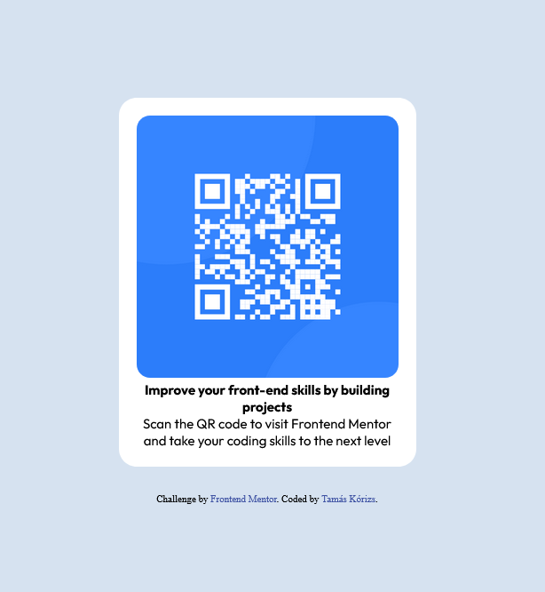

# Frontend Mentor - QR code component solution

This is a solution to the [QR code component challenge on Frontend Mentor](https://www.frontendmentor.io/challenges/qr-code-component-iux_sIO_H). Frontend Mentor challenges help you improve your coding skills by building realistic projects.

## Table of contents

- [Overview](#overview)
  - [Screenshot](#screenshot)
  - [Links](#links)
- [My process](#my-process)
  - [Built with](#built-with)
  - [What I learned](#what-i-learned)
  - [Useful resources](#useful-resources)
- [Author](#author)

## Overview

### Screenshot



### Links

- Solution URL: [QR Code Component](https://qr-code-component-murex-seven.vercel.app/ "QR Code Component")

## My process

### Built with

- Semantic HTML5 markup
- CSS custom properties
- Flexbox
- CSS Grid
- Mobile-first workflow

### What I learned

In this project I had to use CSS Flexbox to position the elements inside the wrapper.

```html
<div class="wrapper"></div>
```

```css
.wrapper {
  display: flex;
  flex-direction: column;
  justify-content: center;
  align-items: center;
}
```

### Useful resources

- [CSS Flexbox Layout Guide](https://css-tricks.com/snippets/css/a-guide-to-flexbox/ "CSS Flexbox Layout Guide") - This helped me for doing CSS Flexbox reason.
- [W3Schools](https://www.w3schools.com/ "W3Schools") - If you want to learn to code ;)

## Author

- Frontend Mentor - [@korizst](https://www.frontendmentor.io/profile/korizst "Tamás Kórizs")
